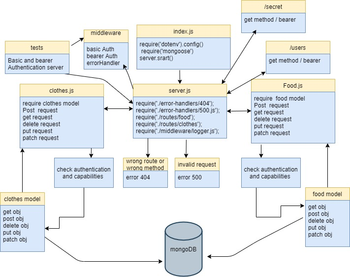

# auth-api

An Express/Node.js based server using a custom “authentication” module that is designed to handle user registration and sign in using Basic, Bearer, or OAuth along with a custom “authorization” module that will grant/deny users access to the server based on their role or permissions level

**Author:** Nour Abu El-Enein

**Links:**

- [Repo Link](https://github.com/engnour94/auth-api)
- [GitHub Actions](https://github.com/engnour94/auth-api/actions)
- [Deployed Site](https://auth-api-by-nour.herokuapp.com/)

## Setup

### Install

- Clone the repository from GitHub
- Run the command `npm i express dotenv morgan base-64 bcrypt cors mongoose jsonwebtoken jest @code-fellows/supergoose` to install dependencies
- create .env file with PORT variable and `MONGODB_URI=mongodb:******` and a secret key `SECRET=****`

### Test

- Run the command `npm test` to test and verify the server and the middlewares are working.
- Run the command `npm run lint` for testing lint.

### Running the app
`npm run start`

### Endpoints: 

* post `/signin` ---> 'Basic Auth'

* post `/signup` ---> 'No Auth '

* let `/users` ----> bearer

* get `/secret` ----> bearer

* CRUD `/api/v1/model` ---> Oauth

* CRUD `/api/v2/model` ---> Oauth

 ### Returns Object

  user {
    "_id": "String",
    "username": "String",
    "password": "String",
    "role": "String"
  }

foodModel {
    name: String,
    calories: Number,
    type: enum
}

clothesModel {
    name: String,
    color: String,
    size: String
}

## Documentation

### UML Diagram

